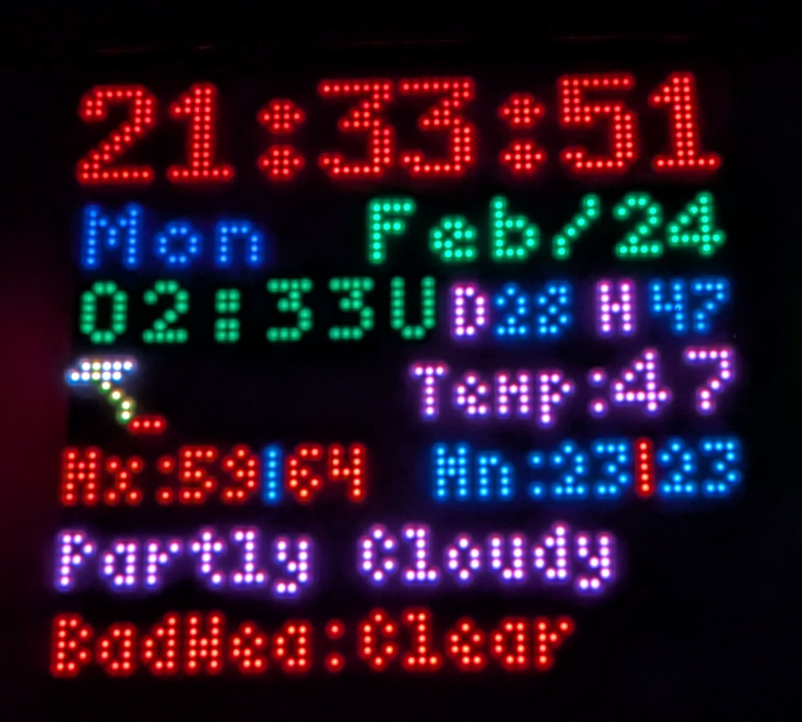
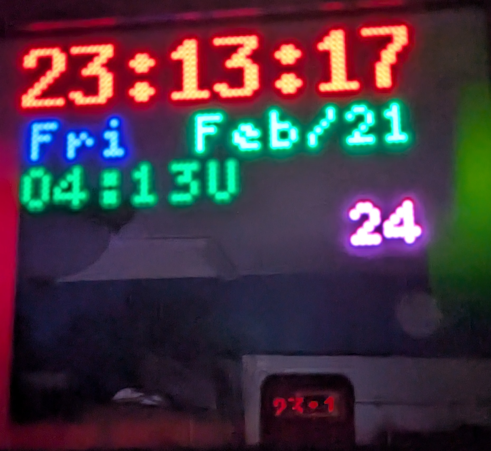

# LED Matrix Clock with Weather Data

## Overview
This script displays a clock and weather information on a 64x64 RGB LED matrix using the `rgbmatrix` library. It can fetch weather data from either local files or an MQTT broker.

## Features
- Displays local time, date, and GMT time
- Shows current temperature, max/min temperatures, humidity, and dew point
- Shows the Highest and Lowest temperatures forecast over the next 5 days
- Displays weather conditions, Lightning probability, and adverse forecast for the next 5 days
- Can show Severe and Extreme Weather alerts from NOAA.gov
- Fetches weather data from either local files or MQTT
- Adjustable brightness 
- Scale back the data shown between certain hours
- Debug mode for additional logging





## Usage
Run the script with:
```bash
python screen64-64-weather.py [options]
```

### Command-line Arguments
- `--debug` : Enable debug output
- `--data-source` : Choose the data source (`file` or `mqtt`), default is `file`
- `--mqtt-broker` : Specify the MQTT broker hostname (default: `localhost`)
- `--mqtt-port` : Specify the MQTT broker port (default: `1883`)

Example:
```bash
python screen64-64-weather.py --debug --data-source mqtt --mqtt-broker 192.168.1.10
```

## Data Sources
The script supports two data sources:
1. **File-based Data**
   - Reads weather information from text files stored in `/home/riley/api-lookups/localdata/`
2. **MQTT-based Data**
   - Subscribes to weather-related topics from an MQTT broker
   - Topics include temperature, humidity, dew point, and weather alerts

## Display Elements
- **Main clock**: Current time in HH:MM:SS format
- **Date & weekday**: Short format (e.g., `Wed, Jan 10`)
- **GMT Time**: Displays UTC time
- **Temperature**: Current, max, and min temperatures
- **Weather alerts**: Displays warnings or special conditions if available
- **Weather forecast**: Shows upcoming weather conditions and probabilities

## Dependencies
- `rgbmatrix`
- `paho-mqtt`
- `pytz`
- `tzlocal`

## MQTT Topics
The script listens for the following MQTT topics:
```
weather/temp/CURRENT
weather/temp/HIGH
weather/temp/LOW
weather/temp/HIGH2
weather/temp/LOW2
weather/forecast/THUNDER
weather/forecast/COND
weather/forecast/ADVFORE
weather/observed/HUMIDITY
weather/observed/DEWPNT
weather/ALERT
```

## Debug Mode
Enable debug mode with `--debug` to see additional logging about MQTT connections, received messages, and file read errors.

## Notes
- The script is optimized for a 64x64 LED matrix and uses specific fonts for text rendering.
- Ensure that the `fonts/` directory contains the necessary BDF font files for display.
- The script continuously updates the display in a loop and fetches new data periodically.
- See the Readme in api-lookups on how to collect Weather information

---
**Author**: RileyC


